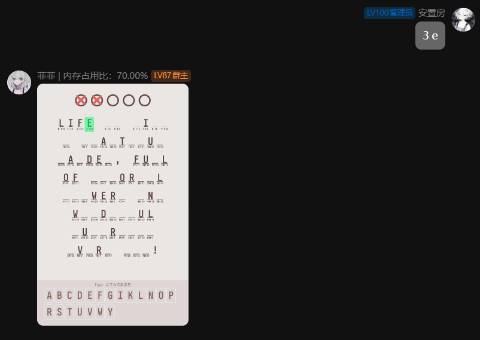
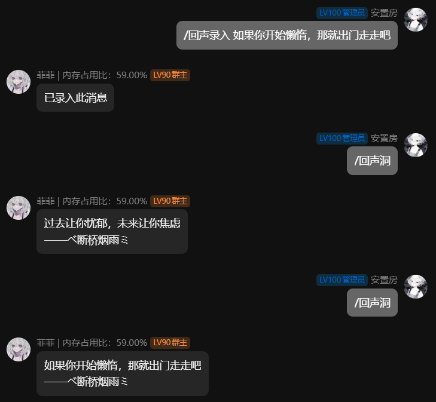

# 菲菲机器人V3

基于Mirai的QQ多功能机器人插件

1.0及2.0由**Java**编写，3.0及之后将以**Kotlin**编写

> 命令系统已重置，子命令更加清晰

## 基础介绍

使用 [Mirai（github）](https://github.com/mamoe/mirai)
框架的QQ群智能机器人插件，接入Deepseek、ChatGPT、Kimi，多种命令且包含等级系统，
Ai回复的Markdown自动解析，关于markdown解析请看我的另一个项目[SimpleParsingMarkdown](https://github.com/AfeiBaili/simpleparsingmarkdown)

## 命令列表

已编写等级系统，根据等级来判断执行人是否执行命令

> 查看命令基础使用可用参数，请直接输入  
> 例如：/help 此命令可以附带参数，直接输入命令"/help"会打印出"help相关命令"

## 机器人配置

使用Json配置，首次启动会默认生成配置文件并报错需要配置完重启，配置路径为：  
[Overflow](https://mirai.mrxiaom.top/) 主目录/config/feifei/config.json

为不同的用户分配命令使用等级

等级映射文件在主目录/data/feifei/level-map.properties，建议通过命令添加其他人等级

> 注意如果没有配置首次运行，等级映射文件生成的管理员是默认配置的QQ，需在等级映射文件中手动更改或删除等级映射文件并自动生成

```json
{
  "master": 2411718391,
  "groups": [
    975709430
  ],
  "bot": {
    "name": "机器人名字"
  },
  "module": {
    "openJoinLeaveMessage": true,
    "openMemoryName": true,
    "enableMinecraft": true,
    "translation": true,
    "echoCave": true,
    "passwordBreakGame": {
      "isOpen": true,
      "fontPath": "字体相对于mirai主目录的相对路径"
    },
    "uploadFile": {
      "isOpen": true,
      "maxFileSize": 5242880,
      "pathList":[
        {
          "name": "路径别名",
          "path": "/路径"
        }
      ]
    }
  },
  "setting": {
    "currentBot": "deepseek",
    "startMessage": "加载群后发送的提示消息",
    "commandPrefix": "/",
    "maxChatLength": 100,
    "printNotFoundCommand": true
  },
  "chatgpt": {
    "key": "chatgpt key",
    "setting": "机器人设定"
  },
  "deepseek": {
    "key": "deepseek key",
    "setting": "机器人设定"
  },
  "kimi": {
    "key": "kimi key",
    "setting": "机器人设定"
  },
  "qwen": {
    "key": "qwen key",
    "setting": "机器人设定"
  },
  "youDao": {
    "appKey": "有道云翻译应用Id",
    "appSecret": "有道云翻译Key"
  },
  "kolors": {
    "key": "kolors key"
  }
}
```

配置参数介绍（新版命令待更新）

**master**: 数值型 主要管理人员QQ

**groups**: 数组型 群聊过滤白名单，防止发送错群

**bot**: 对象型 机器人基本参数

- **qq**: 数值型 机器人QQ号
- **name**: 字符串 机器人名称

**module**: 对象型 大部分为布尔型（可选择的功能）

- **openMemoryName**: 是否开启内存监控并映射在机器人名字上
- **mcModSearch**: 是否开启MC百科搜索功能（搜词条命令功能）
- **translation**: 是否开启翻译功能
- **echoCave**: 是否开启回声洞
- **passwordBreakGame**: 对象型 密文破译小游戏配置
    - **isOpen**: 布尔型 是否开启密文破译小游戏
    - **fontPath**: 字符串 相对于Mirai主目录的相对路径

> fontPath使用例如：“data/feifei/字体.otf”。密文需要的句子可以手动添加，在“data/feifei/sentence.txt”文件中

**setting**: 对象型 机器人设定

- **atByTargetBot**: 字符串 @at机器人时回应的机器人
- **startMessage**: 字符串 插件加载成功后往群里发送的消息
- **commandPrefix**: 字符串 命令前缀（/command中的"/"）

**chatgpt**: 对象型 ChatGPT机器人，默认模型为gpt-4o-mini，可用命令配置模型

- **name**: 字符串 ChatGPT机器人名字（消息包含名字即机器人回答消息）
- **key**: 字符串
  ChatGPT的key，可申请个免费额度，在 [此处（github）](https://github.com/chatanywhere/GPT_API_free) 申请或购买key
- **setting**: 字符串 机器人设定(例如：你是谁谁谁，喜欢干什么，爱怎么怎么地)

> 免费的额度大概用1-3天，付费额度我付款了30不用高模型可以做到一天几分钱-几毛钱

**deepseek**: 对象型 Deepseek机器人，默认模型为聊天模型，可用命令配置推理模型

- **name**: 字符串 Deepseek机器人名字（消息包含名字即机器人回答消息）
- **key**: 字符串
  Deepseek的key，需要在 [硅基流动](https://www.siliconflow.cn/) 注册并填写Key
- **setting**: 字符串 机器人设定(例如：你是谁谁谁，喜欢干什么，爱怎么怎么地)

> Deepseek的充了十块钱用了几个月（性价比之王）

**kimi**: 对象型 Kimi机器人设定（Kimi限时免费但是有限制）

- **key**: Kimi的key在 [Moonshot AI](https://platform.moonshot.cn/docs/intro#获取-api-密钥) 控制台获取
- **setting**: 字符串 机器人设定(例如：你是谁谁谁，喜欢干什么，爱怎么怎么地)

**youDao**: 对象型 [有道云](https://ai.youdao.com/) 配置，在控制台获取

- **appKey**: 字符串 有道翻译的应用ID
- **appSecret**: 字符串 有道翻译的密钥

> 我记得当时绑定微信什么的，送了我50元的额度

**kolors**: 对象型 图片生成模型配置（免费）

- **key**: kolors的key在 [硅基流动](https://www.siliconflow.cn/) 控制台获取

## 其它功能介绍

在菜单中还有一些其它定制功能分别为**创建图片、搜词条、翻译...**：

## 创建图片

使用 [Kwai-Kolors](https://cloud.siliconflow.cn/models) 模型，可在 [硅基流动](https://www.siliconflow.cn/)
官网注册key及免费使用

效果：


## 搜词条

指的是搜索 [MC百科](https://www.mcmod.cn/) 中存在的我的世界（Minecraft）Mod物品

效果：


## 翻译

使用 [有道翻译](https://fanyi.youdao.com/)
需要注册并配置key，自动根据中/英翻译为中/英，根据a-Z字母存在判断数量是否大于中文

效果：


## 密文破译小游戏

填入全部正确的字母游戏即胜利

#### 游戏机制讲解：

在一个字母方格中有“**字母**”，“**位置下标（左）**”，“**字符下标（右）**” 三个要素

容错机制：最上面的圆圈代表容错次数，最多五次  
填入机制：其中留空的字母，就是你要通过“位置下标”来进行**填补**的字母，
例如：“3 e”在位置下标3的位置填入字母e。填入正确为绿色，错误为红色  
字符机制：在每局中所有出现过相同的字母都会随机获得一个**字符下标**。相同的字符下标一致，其字母也将是一致的

效果：


## 回声洞

你的留言，可以在此机器人中一直存在  
在群1留下的信息，在群2可以接收

效果：


## 更多命令未展示

## 欢迎提交建议和BUG