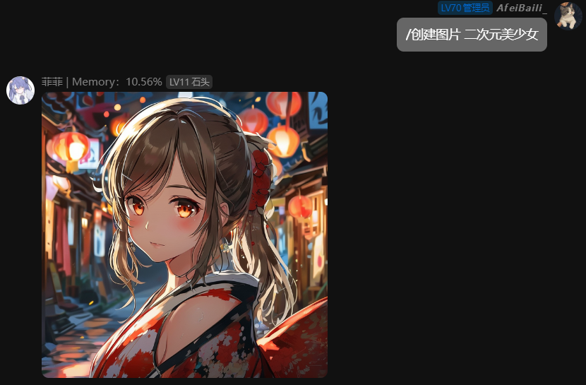
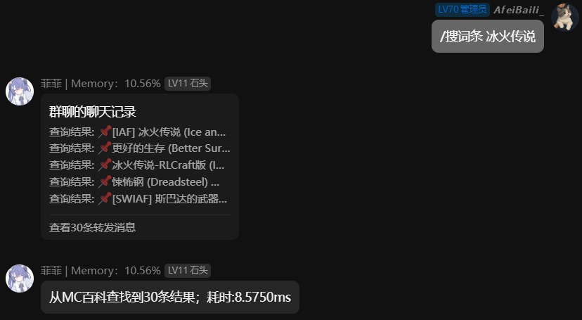
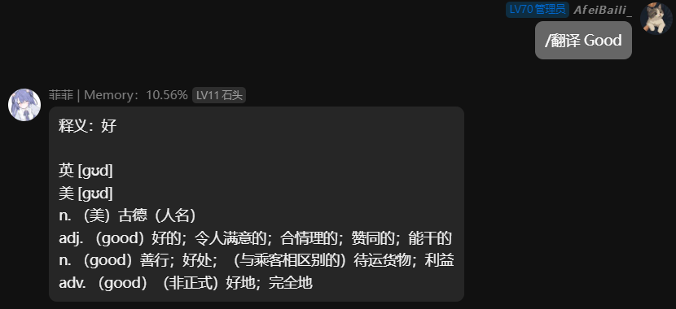

# 菲菲机器人V3

1.0及2.0由**Java**编写，3.0及之后将以**Kotlin**编写

## 基础介绍

使用 [Mirai（github）](https://github.com/mamoe/mirai)
框架的QQ群智能机器人插件，接入Deepseek、ChatGPT、Kimi，多种命令且包含等级系统，
Ai回复的Markdown自动解析，关于markdown解析请看我的另一个项目[SimpleParsingMarkdown](https://github.com/AfeiBaili/simpleparsingmarkdown)

## 命令列表

已编写等级系统，根据等级来判断执行人是否执行命令

| 命令         | 等级 |
|------------|----|
| 菜单         | 0  |
| 聊天功能       | 1  |
| 设置等级       | 4  |
| 查看所有人等级    | 0  |
| 查看机器人当前模型  | 0  |
| 查看机器人所有模型  | 0  |
| 切换机器人模型    | 2  |
| 查看机器人API余额 | 0  |
| 重置菲菲       | 2  |
| 重置小鲸鱼      | 2  |
| 重置kimi     | 2  |
| 重置所有       | 3  |
| 获取机器人聊天记录  | 1  |
| 新设定        | 1  |
| 查看群        | 0  |
| 添加群        | 2  |
| 删除群        | 3  |
| 开启流        | 1  |
| 关闭流        | 1  |
| 开启沉浸式对话    | 0  |
| 关闭沉浸式对话    | 0  |
| 设置命令前缀     | 3  |
| 重载配置文件     | 4  |
| 禁言         | 3  |
| 解除禁言       | 3  |
| 踢出         | 4  |
| 创建图片       | 0  |
| 搜词条        | 0  |
| 翻译         | 0  |

> 查看命令基础使用可用参数，请直接输入  
> 例如：/开启流 此命令需要两个参数，直接输入命令会打印出"开启流 <机器人1 | 机器人2>"

## 机器人配置

使用Json配置，首次启动会默认生成配置文件并报错需要配置完重启，配置路径为：  
[Overflow](https://mirai.mrxiaom.top/) 主目录/config/feifei/config.json

> 感谢一切开源人员的付出

等级映射文件在主目录/data/feifei/level-map.properties，建议通过命令添加其他人等级

> 注意如果没有配置首次运行，等级映射文件生成的管理员是默认配置的QQ，需在等级映射文件中手动更改或删除等级映射文件并自动生成

```json
{
  "master": 2411718391,
  "groups": [
    975709430
  ],
  "bot": {
    "qq": 2664306741,
    "name": "机器人名字"
  },
  "module": {
    "openMemoryName": true,
    "mcModSearch": true,
    "translation": true
  },
  "setting": {
    "atByTargetBot": "<chatgpt | deepseek>",
    "startMessage": "加载群后发送的提示消息",
    "commandPrefix": "/"
  },
  "chatgpt": {
    "name": "chatgpt 称呼",
    "key": "chatgpt key",
    "setting": "机器人设定"
  },
  "deepseek": {
    "name": "deepseek 称呼",
    "key": "deepseek key",
    "setting": "机器人设定"
  },
  "kimi": {
    "key": "kimi key",
    "setting": "机器人设定"
  },
  "youDao": {
    "appKey": "有道云翻译应用Id",
    "appSecret": "有道云翻译Key"
  },
  "kolors": {
    "key": "kolors key"
  }
}
```

配置参数介绍

**master**: 数值型 主要管理人员QQ

**groups**: 数组型 群聊过滤白名单，防止发送错群

**bot**: 对象型 机器人基本参数

- **qq**: 数值型 机器人QQ号
- **name**: 字符串 机器人名称

**module**: 对象型 全部为布尔型（可选择的功能）

- **openMemoryName**: 是否开启内存监控并映射在机器人名字上
- **mcModSearch**: 是否开启MC百科搜索功能（搜词条命令功能）
- **translation**: 是否开启翻译功能

**setting**: 对象型 机器人设定

- **atByTargetBot**: 字符串 @at机器人时回应的机器人
- **startMessage**: 字符串 插件加载成功后往群里发送的消息
- **commandPrefix**: 字符串 命令前缀（/command中的"/"）

**chatgpt**: 对象型 ChatGPT机器人，默认模型为gpt-4o-mini，可用命令配置模型

- **name**: 字符串 ChatGPT机器人名字（消息包含名字即机器人回答消息）
- **key**: 字符串
  ChatGPT的key，可申请个免费额度，在 [此处（github）](https://github.com/chatanywhere/GPT_API_free) 申请或购买key
- **setting**: 字符串 机器人设定(例如：你是谁谁谁，喜欢干什么，爱怎么怎么地)

> 免费的额度大概用1-3天，付费额度我付款了30不用高模型可以做到一天几分钱-几毛钱

**deepseek**: 对象型 Deepseek机器人，默认模型为聊天模型，可用命令配置推理模型

- **name**: 字符串 Deepseek机器人名字（消息包含名字即机器人回答消息）
- **key**: 字符串
  Deepseek的key，需要在 [硅基流动](https://www.siliconflow.cn/) 注册并填写Key
- **setting**: 字符串 机器人设定(例如：你是谁谁谁，喜欢干什么，爱怎么怎么地)

> Deepseek的充了十块钱用了几个月（性价比之王）

**kimi**: 对象型 Kimi机器人设定（Kimi限时免费但是有限制）

- **key**: Kimi的key在 [Moonshot AI](https://platform.moonshot.cn/docs/intro#获取-api-密钥) 控制台获取
- **setting**: 字符串 机器人设定(例如：你是谁谁谁，喜欢干什么，爱怎么怎么地)

**youDao**: 对象型 [有道云](https://ai.youdao.com/) 配置，在控制台获取

- **appKey**: 字符串 有道翻译的应用ID
- **appSecret**: 字符串 有道翻译的密钥

> 我记得当时绑定微信什么的，送了我50元的额度

**kolors**: 对象型 图片生成模型配置（免费）

- **key**: kolors的key在 [硅基流动](https://www.siliconflow.cn/) 控制台获取

## 其它功能介绍

在菜单中还有一些其它定制功能分别为**创建图片、搜词条、翻译**：

创建图片，使用 [Kwai-Kolors](https://cloud.siliconflow.cn/models) 模型，可在 [硅基流动](https://www.siliconflow.cn/)
官网注册key及免费使用

效果：


搜词条，指的是搜索 [MC百科](https://www.mcmod.cn/) 中存在的我的世界（Minecraft）Mod物品

效果：


翻译，使用 [有道翻译](https://fanyi.youdao.com/)
需要注册并配置key，自动根据中/英翻译为中/英，根据a-Z字母存在判断数量是否大于中文

效果：


## 欢迎提交建议和BUG